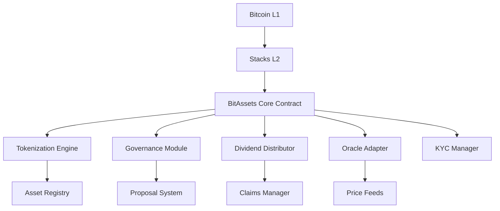
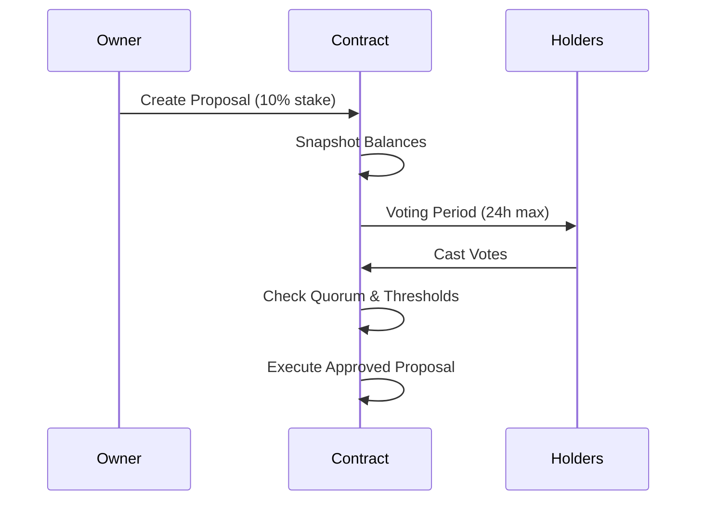

# BitAssets Protocol: Compliant Real-World Asset Tokenization on Bitcoin

## 🌟 Overview

BitAssets is a revolutionary protocol enabling compliant tokenization of real-world assets (RWAs) on Bitcoin through Stacks Layer 2. Combining Bitcoin's security with advanced smart contract capabilities, it creates a regulatory-friendly framework for fractional ownership, governance, and profit distribution.

## 🚀 Key Features

| Feature | Icon | Description |
|---------|------|-------------|
| **Bitcoin-Secured** | 🛡️ | Leverages Bitcoin's proof-of-transfer consensus |
| **Fractional Ownership** | 📈 | Tokenizes assets into 100,000 standardized SFTs |
| **On-Chain Governance** | 🗳️ | Quadratic voting system with token-weighted influence |
| **Dividend Automation** | 💸 | Claim-on-demand system with historical tracking |
| **Compliance First** | 🔒 | 5-level KYC system with expiration controls |
| **Oracle Integration** | 🔄 | Real-time price feeds from trusted providers |



## 🏗 Core Architecture

### 1. Tokenization Engine
- **Asset Registration**: Create semi-fungible tokens (SFTs) with IPFS metadata
- **Fixed Supply Model**: 100,000 tokens per asset standard
- **Oracle Integration**: Dynamic valuation via decentralized price feeds

### 2. Governance Module
- **Proposal System**: Minimum 10% token stake to create proposals
- **Time-Bound Voting**: 1-24 hour voting periods with quorum checks
- **Automatic Execution**: Approved proposals execute without intermediaries

### 3. Compliance Layer
- **Tiered KYC**: 5-level verification system (FATF Travel Rule compliant)
- **Asset Locking**: Regulatory hold capabilities (SEC Regulation D)
- **Audit Trails**: Immutable transaction history (GDPR compliant)

### 4. Dividend Distributor
- **Proportional Allocation**: Real-time profit sharing calculations
- **Multi-Asset Support**: Simultaneous management of multiple asset dividends
- **Claim Verification**: Anti-double-spend protection with historical tracking

## 🔄 Protocol Workflows

### Asset Tokenization Process
1. **Registration** → 2. Oracle Verification → 3. SFT Minting →  
4. Initial Distribution → 5. Secondary Trading (with KYC checks)

### Governance Lifecycle


### Dividend Distribution
- **Step 1**: Profit declaration with STX/USDC allocation
- **Step 2**: Automatic pro-rata calculation per token holder
- **Step 3**: User-initiated claims with instant verification

## 🔐 Security & Compliance

### Protection Mechanisms
| Mechanism | Description | Impact |
|-----------|-------------|--------|
| Multi-Sig Admin | 3/5 signing threshold for critical ops | Prevents single point failure |
| Time-Locks | 72-hour delay for contract upgrades | Community oversight |
| Oracle Checks | Freshness validation (<24h old data) | Price accuracy |

### Compliance Features
| Feature | Technical Implementation | Regulation |
|---------|--------------------------|------------|
| KYC Tiers | `kyc-status` map with level/expiry | FATF Rule |
| Asset Freezes | `lock-asset` admin function | SEC Reg D |
| Whitelisting | `approved-traders` list | MiCA |

## 📊 Data Model

### Core Storage Maps
```clarity
(define-map assets {
    asset-id: uint
    => {
        owner: principal,
        value: uint,
        tokens-minted: uint,
        status: (enum active frozen)
    }
})

(define-map kyc-status {
    user: principal
    => {
        level: uint,
        expires-at: uint
    }
})
```

### Critical Constants
| Constant | Value | Purpose |
|----------|-------|---------|
| MAX_ASSET_VALUE | 10M STX | Anti-money laundering |
| MIN_PROPOSAL_DURATION | 1 hour | Governance security |
| KYC_EXPIRY | 365 days | Compliance renewal |

## 🚀 Deployment & Usage

### Setup Process
1. Initialize contract with `contract-owner`
2. Configure oracle principals via `set-oracle`
3. Establish KYC provider whitelist

### Common Interactions
```clarity
;; Asset Registration
(register-asset "ipfs://QmMetadata" u500000 0x1234.oracle)

;; Dividend Claim
(claim-dividends u42 150000)

;; Governance Proposal
(create-proposal u15 "Update fee structure" u24 u10000)
```

## 💡 Example Scenario

**Real Estate Tokenization:**
1. Owner registers $10M property → mints 100,000 PROPT tokens
2. 500 investors acquire tokens via secondary market
3. Monthly rent dividends distributed proportionally
4. Community votes to approve property renovation
5. Oracle updates asset valuation post-renovation

## 🤝 Contribution Guidelines

1. **Proposal Submission**: Draft improvement via GitHub PR
2. **Community Voting**: 60% approval threshold from token holders
3. **Security Audit**: Mandatory third-party code review
4. **Time-Locked Deployment**: 72-hour final review period

```clarity
;; Sample Contribution Proposal
(create-proposal 
    u89 
    "Implement NFT collateralization" 
    u48     ;; 48h duration
    u25000  ;; 25k token threshold
)
```
